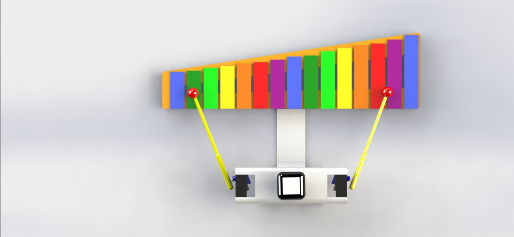

# 🎶 Xylophone‑Playing Music Robot

### *Arduino‑Powered Therapeutic Music Player Robot (ADHD-Friendly)*

A robotic system designed to play xylophone notes using dual‑arm servo mechanisms. The robot is controlled via a Python server and mobile app, enabling music playback through serial commands. Built for **therapeutic use**, especially for **ADHD children**, to create engaging auditory interaction through motion and rhythm.

---

## 📸 Demo


 
 

---

## 🚀 Features

* 🎵 **Plays real xylophone notes** using a left & right servo arm
* 🦾 **Dual‑arm mechanism**: shoulder (yaw) + elbow (strike) per side
* 🤖 **Precise servo angles per note** using a mapped lookup table
* 📡 **Wireless song selection** via Python TCP server + mobile app
* 🎼 **Supports 6 predefined songs** (children’s melodies)
* 🧠 **Therapeutic application** for attention and rhythm training
* ⚡ **Smooth, stable motion** through controlled servo timing
* 🔌 **Simple hardware architecture** using Arduino + MG995/SG90 servos

---

## 🛠 Tech Stack

| Component       | Technology                          |
| --------------- | ----------------------------------- |
| Microcontroller | Arduino                             |
| Motion Control  | Servo (MG995 + SG90)                |
| Programming     | C++ / Arduino, Python               |
| Communication   | USB Serial + TCP Socket             |
| Mobile App      | Android (text-based command sender) |

---

## 🧠 How It Works

### 1️⃣ Selecting the Music

A song ID (1–6) is sent from the mobile app → Python Server.py → Arduino.

Example logic from `Server.py`:

```python
if 'تاب تاب' in msg:
    ser.write(b"1")
elif 'خونه ی مادربزرگه' in msg:
    ser.write(b"2")
...
```

---

### 2️⃣ Receiving Commands on Arduino

`MusicPlayerRobot.ino` waits for a serial command:

```cpp
int musicId = Read_Serial();
```

When received, it loads the correct melody:

```cpp
if (musicId == 1) music = music1;
if (musicId == 2) music = music2;
...
```

---

### 3️⃣ Mapping Notes → Physical Coordinates

Each note corresponds to an index in the **angle[]** array:

```cpp
char angle[] = {53,60,67,73,83,93,103,45,55,64,72,82,93,103,112};
```

Notes < 7 → left arm
Notes ≥ 7 → right arm

---

### 4️⃣ Striking Motion

Each strike is a controlled down‑and‑up elbow motion:

```cpp
Left_elbow.write(120);  // down
Left_elbow.write(70);   // up
```

This replicates the physical action of hitting a xylophone key.

---

## 🎼 Predefined Songs

Your robot includes **6 children’s songs**, such as:

* تاب تاب
* خونه‌ی مادربزرگه
* تولدت مبارک (two versions)
* برف
* خوشحال و شاد و خندان

Each melody is stored as an array of notes and rests (`-1`).

Example:

```cpp
int music1[] = {10, -1, 9, -1, 8, 8, 9, -1, ... };
```

---

## 🔧 Hardware Setup

* **4 Servos**

  * Left Shoulder (pin 3)
  * Right Shoulder (pin 5)
  * Left Elbow (pin 6)
  * Right Elbow (pin 9)

* **Arduino Uno / Mega**

* **Xylophone Instrument**

* **Wooden / 3D printed arms**

* **External 5–6V servo power recommended**

---

## 🔌 Communication Flow

```
[ Android App ]  
       ↓ TCP (Port 80)
[ Python Server.py ]  
       ↓ USB Serial  
[ Arduino (MusicPlayerRobot.ino) ]  
       ↓ Servo Outputs  
[ Robot Arm Hits Xylophone ]
```

---

## ▶️ Running the System

### 1. Upload Arduino Code

Open **MusicPlayerRobot.ino** → Upload

### 2. Start Python Server

```bash
python Server.py
```

### 3. Send Command from Mobile App

Example messages:

* "تاب تاب"
* "برف"
* "تولدت مبارک 1"

The robot will begin playing automatically.

---

## 👨‍💻 Author

**Mohammad Alaei**
AI Researcher & Computer Engineer
🔗 [https://alaeimo.ir](https://alaeimo.ir)


## Academic Note
This project was originally developed as my B.Sc. thesis project in Electrical & Computer Engineering (Robotics).  
All code is cleaned, documented, and published for educational and research purposes.
